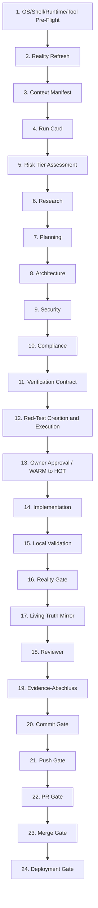
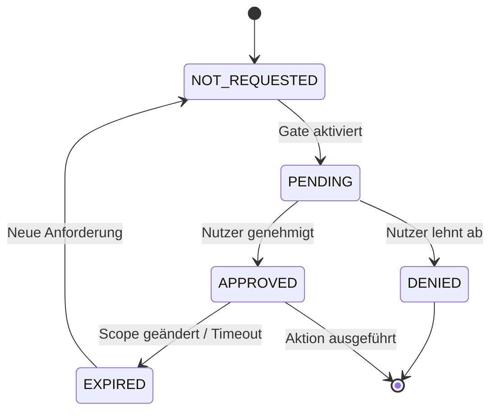

# Canonical Working Method — OpenCode Agent Ecosystem

> **Version**: 1.0.0
> **Category**: Canonical Workflow Contract
> **Status**: ACTIVE
> **Scope**: Binding for all coding agents operating within or through the OpenCode Agent Ecosystem
> **Overrides**: Deviating workflow specifications in earlier AGENTS.md, README.md, or per-project rules are superseded by this document where they conflict.

---

## Core Principles

1. **Reality Wins** — Der tatsächliche Runtime- und Repository-Zustand hat immer Vorrang vor Dokumentation, Speicher oder Behauptungen.
2. **Evidence Before Claims** — Kein Anspruch (Severity, Architektur, Migration, Bug-Fix, Feature, Compliance) ohne belegbare Evidence.
3. **Plan Before Writes** — Keine Dateiänderung ohne expliziten Plan, Scope und Acceptance Criteria.
4. **Red Tests Before Implementation** — Soweit technisch möglich zuerst ein fehlschlagender Test, der das gewünschte Verhalten zeigt.
5. **Dry-Run Before Apply** — Jede Änderung zuerst im Dry-Run-Modus validieren.
6. **Local Checks Before Remote Checks** — Lokale Tests und Validierung vor Remote-CI.
7. **Reviewer Before Completion** — Keine Aufgabe ist abgeschlossen, bevor der Reviewer sie bestätigt hat.
8. **Human Approval Before Irreversible Actions** — Apply, Commit, Push, PR, Merge, Deployment, Remote-CI, Skill Writes und Memory Writes benötigen menschliche Freigabe.
9. **Smallest Safe Scope** — Nur die minimal notwendigen Änderungen durchführen.
10. **Preserve Unrelated Work** — Fremde lokale Änderungen niemals überschreiben oder pauschal stagen.
11. **No Fake Execution** — Keine Tool-, Test-, Runtime-, Datei-, Issue-, PR- oder Log-Ausführung behaupten, die nicht tatsächlich stattgefunden hat.
12. **No Hidden Assumptions** — Alle Annahmen und Unsicherheiten explizit dokumentieren.
13. **No Secrets In Evidence** — Keine Secrets, Tokens oder PII in Logs, Reports oder Commits.

---

## Source of Truth Hierarchy

This hierarchy defines which information source prevails when sources disagree.

1. **Tatsächlicher lokaler Repository- und Runtime-Zustand (Reality Truth)**
   - Der aktuell auf der Festplatte liegende Code, die tatsächliche Verzeichnisstruktur, laufende Prozesse, vorhandene Tools.
   - Überschreibt alle anderen Schichten.

2. **Ausführbarer Code, Konfiguration, Tests und Schemas (Executable Truth)**
   - Dateien, die das Systemverhalten deterministisch definieren (package.json, pyproject.toml, Dockerfile, CI-Configs, Datenbankschemas).
   - Überschreibt alle Schichten unterhalb, kann aber durch Layer 0 widerlegt werden (z. B. wenn die Festplatte eine andere Version enthält).

3. **Reproduzierbare Evidence (Evidence Truth)**
   - Logs, Screenshots, Testausgaben, Diff-Outputs, die in der aktuellen Session oder einer dokumentierten vorherigen Session erzeugt wurden.
   - Überschreibt Dokumentation und Memory, kann aber durch Layer 0–1 widerlegt werden.

4. **GitHub Issue oder lokaler Run Report (Documentation Truth)**
   - Bei GitHub-Verfügbarkeit: das Issue als Source of Truth. Bei fehlendem GitHub-Zugriff: der lokale Run Report.
   - Kann durch Layer 0–3 widerlegt werden. Niemals eine Behauptung aus einem Issue übernehmen, wenn der lokale Zustand widerspricht.

5. **Technische und nutzerbezogene Dokumentation (Documentation Truth)**
   - README, BOOTSTRAP.md, AGENTS.md, ADRs, Policies, ARCHITECTURE.md, CONTRIBUTING.md.
   - Kann durch Layer 0–4 widerlegt werden. Widersprechende Dokumentation als `STALE` markieren.

6. **Chat- und Memory-Kontext (Memory/Chat Context)**
   - Vorherige Konversationen, Agent-Memory-Dateien, Embedding-Suchtreffer.
   - Darf niemals höhere Layer überschreiben.

### Rule: `REALITY_WINS`

Bei Widersprüchen zwischen diesen Schichten die Interpretation der Realität niemals an eine veraltete Dokumentation anpassen. Stattdessen:

1. Widerspruch dokumentieren
2. Veraltete Quelle als `STALE` markieren
3. Entscheidung auf Basis der höherwertigen Schicht treffen
4. Ggf. die veraltete Quelle zur Aktualisierung vorschlagen

---

## Truth Layers

| Layer | Name | Description | Override Rule |
|-------|------|-------------|---------------|
| 0 | **Reality Truth** | Der tatsächliche Runtime-/Repository-Zustand (Festplatte, Prozesse, Tools) | Höchste Priorität, überschreibt alle anderen |
| 1 | **Executable Truth** | Ausführbarer Code, Tests, Konfiguration, Schemas | Kann nur durch Layer 0 überschrieben werden |
| 2 | **Evidence Truth** | Reproduzierbare Logs, Screenshots, Testausgaben, Diffs | Kann nur durch Layer 0–1 überschrieben werden |
| 3 | **Documentation Truth** | Issues, ADRs, Reports, Policies, Run Reports | Kann nur durch Layer 0–2 überschrieben werden |
| 4 | **Memory/Chat Context** | Chat-Verlauf, Agent-Memory-Dateien, Embeddings | Darf niemals höhere Layer überschreiben |

---

## Context Levels

Der Context Level bestimmt, welche Operationen ein Agent in der aktuellen Session ausführen darf.

### COLD Context

Der Agent hat nur das absolute Minimum an Information.

**Enthält nur:**
- Auftrag / Task-Beschreibung
- Repository-URL oder lokaler Pfad
- Hard Constraints (Zeit, Kosten, Sicherheit, Compliance)
- Source-of-Truth-Verweise (Issue-Nummer, Run-Report-Pfad)

**Erlaubt:**
- Reality Refresh (Repository-Zustand prüfen)
- Ressourcen- und Tool-Discovery
- Context-Anforderung beim Nutzer
- Entscheidung: Wechsel zu WARM möglich?

**Verboten:**
- ❌ Keine Implementierung
- ❌ Keine Planung
- ❌ Keine Delegation an Subagenten
- ❌ Keine Dateiänderungen
- ❌ Keine Behauptungen über Code-Zustand

### WARM Context

Der Agent hat den Repository-Zustand validiert und die Aufgabe analysiert.

**Enthält zusätzlich:**
- Validierte Repository-Fakten (Tool-Versionen, Abhängigkeiten, vorhandene Tests)
- Issue oder Run Report (vollständig gelesen)
- Architektur-Skizze (betroffene Module, Schnittstellen)
- Betroffene Dateien (vollständige Liste)
- Vorhandene Tests (welche Tests existieren, welche könnten relevant sein)
- Bekannte Risiken (aus Policies, früheren Runs, Security-Hinweisen)

**Erlaubt:**
- Research (externe Doku, API-Referenzen)
- Planung (Plan-Agent, Speckit-Workflow)
- Delegation an Analyse-Subagenten (Research, Architecture, Security, Compliance)
- Risikoanalyse
- Run Card Erstellung
- Verification Contract Entwurf

**Verboten:**
- ❌ Keine Implementierung
- ❌ Keine Dateiänderungen
- ❌ Kein Apply

### HOT Context

Der Agent hat Planung, Approval und Runtime-Zugriff.

**Enthält zusätzlich:**
- Aktuellen Diff (geplante Änderungen)
- Testausgaben (vor und nach Änderungen)
- Logs (Runtime-Evidence)
- Runtime-Evidence (Tool-Outputs, Screenshots)
- Offene Findings (aus Security/Compliance-Review)
- Approval-Status (pro Gate)

**Erlaubt:**
- Implementierung
- Code-Änderungen
- Test-Ausführung
- Review
- Evidence-Abschluss
- Run-Berichtserstellung

**Verboten:**
- ❌ Keine irreversiblen Aktionen ohne Approval
- ❌ Keine Commit/Push/PR ohne Gate

### Context Transition Rules

| Von | Nach | Bedingung |
|-----|------|-----------|
| COLD | WARM | Reality Refresh abgeschlossen, Issue/Run-Report gelesen, betroffene Dateien identifiziert |
| WARM | HOT | Plan liegt vor, Risk Tier bestimmt, Verification Contract erstellt, Owner Approval für WARM→HOT erteilt |
| HOT | COLD | Context Compaction erforderlich (Speicherlimit, neuer Task, Provider-Wechsel) |

**Bei Context Compaction:** Hard Constraints vor dem Wechsel neu einspielen.

---

## Risk Tiers (Workflow Risk Tiers)

Diese Risk Tiers sind **separat** von den MCP Trust Tiers (siehe [MCP Trust Tiers](#mcp-trust-tiers-reference)). Sie definieren, wie aufwändig der Workflow für eine gegebene Aufgabe sein muss.

### LOW_LOCAL

**Charakterisierung:** Kleine, lokale, reversible Änderung ohne externe Effekte.

**Kriterien:**
- 1–3 Dateien, keine neuen Abhängigkeiten
- Keine externen Systeme (keine APIs, keine Datenbanken, keine Netzwerke)
- Keine sensitiven Daten (keine PII, keine Secrets, keine Credentials)
- Reversibel (einfacher `git checkout` stellt alten Zustand wieder her)
- Rein lokale Logik (keine Auswirkungen auf CI, Deployment, andere Nutzer)

**Workflow:**
1. Lightweight Spec (Ziel, Scope, Akzeptanzkriterien)
2. Verification Contract
3. Local Tests
4. Reviewer (bei Codeänderung zwingend)
5. Evidence-Abschluss

### MEDIUM_REVIEW

**Charakterisierung:** Mehrere Dateien oder Module, neue Abhängigkeit, API- oder Architekturwirkung.

**Kriterien:**
- 4+ Dateien oder mehrere Module
- Neue Abhängigkeit (npm, pip, docker image)
- API-Nutzung (fremde API, interne API mit bestehendem Vertrag)
- Architekturwirkung (neue Schnittstelle, geändertes Datenmodell)
- Bestehende Tests müssen angepasst werden

**Workflow:**
1. Spec
2. Plan (mit Scope- und Risikoanalyse)
3. Tasks
4. Security/Compliance-Screening (automatisiert, kein Vollaudit)
5. Verification Contract
6. Local Tests
7. Reviewer
8. Evidence-Abschluss

### HIGH_HUMAN_GATE

**Charakterisierung:** Infrastruktur, Security, Auth, Migration, PII, externe Systeme, Kosten, Deployment.

**Kriterien:**
- Infrastruktur-Änderungen (Docker, CI/CD, Cloud-Ressourcen, Netzwerk)
- Security-relevante Änderungen (Auth, Verschlüsselung, Secrets-Handling, Input-Validation)
- Datenbank-Migrationen (Schema-Änderungen, Daten-Migrationen)
- PII- oder DSGVO-relevante Änderungen (neue Datenfelder, neue Verarbeitungszwecke)
- Externe System-Integrationen (fremde APIs, Webhooks, Drittanbieter-SDKs)
- Kostenrelevante Änderungen (Cloud-Ressourcen, API-Kosten)
- Deployment-Konfiguration (Production-Deployment, Rollback-Strategie)

**Workflow:**
1. Full Speckit (Constitution → Specify → Plan → Tasks)
2. GitHub Issue (bei GitHub-Verfügbarkeit)
3. Verification Contract
4. Red Tests (soweit möglich)
5. Security Review
6. Compliance Review
7. Owner Approval
8. Implementation
9. Local Validation
10. Truth Mirror
11. Reviewer
12. Evidence-Abschluss

### CRITICAL_BLOCK

**Charakterisierung:** Produktive destruktive Operation, Datenverlustrisiko, ungeprüfte Secrets, irreversibler Lauf ohne Backup.

**Kriterien (eines reicht für CRITICAL_BLOCK):**
- Produktive destruktive Operation (`rm -rf`, `DROP TABLE`, `DELETE FROM`)
- Datenverlustrisiko (force push, format, backup-los)
- Ungeprüfte Secrets in Logs/Code/Config
- Fehlende legitime Session (nicht authentifiziert für erforderliche Aktion)
- Fehlende notwendige Credentials (API-Key, Token nicht gesetzt)
- Force-Push
- Remote-CI für privates Repository ohne Owner Approval
- Irreversibler Lauf ohne Backup

**Workflow:**
- ❌ **Keine Implementierung**, bis der Blocker beseitigt ist
- Blocked-Status dokumentieren
- Dem Nutzer die genaue Blockade melden
- Erst nach Beseitigung des Blockers: Workflow gemäß des tatsächlichen Risk Tiers (nach Blocker-Beseitigung)

---

## Agent Execution Order

Dies ist der verbindliche Ablauf für jeden Task ab Risk Tier MEDIUM_REVIEW. Für LOW_LOCAL kann gekürzt werden (auf die wesentlichen Schritte reduziert).



### Step Details

| # | Step | Beschreibung | Output |
|---|------|-------------|--------|
| 1 | **OS/Shell/Runtime/Tool Pre-Flight** | OS erkennen, verfügbare Shell, Node/Python/andere Runtimes, MCP-Tools, Git-Status. Keine Behauptungen ohne Discovery. | Tool-Manifest |
| 2 | **Reality Refresh** | `git fetch --all --prune` (bei GitHub), `git status`, `git diff --stat`, uncommitted changes erfassen. | Reality-Bericht |
| 3 | **Context Manifest** | Context Level bestimmen, Source of Truth identifizieren, Hard Constraints dokumentieren. | Context Manifest |
| 4 | **Run Card** | Validierte Run Card mit Scope, Akzeptanzkriterien, Tests, Risiken und Rollback-Strategie erstellen. | Run Card |
| 5 | **Risk Tier Assessment** | Risk Tier bestimmen (LOW_LOCAL / MEDIUM_REVIEW / HIGH_HUMAN_GATE / CRITICAL_BLOCK) und Workflow-Module auswählen. | Risk Tier |
| 6 | **Research** | Externe Doku prüfen (APIs, SDKs, Provider, MCP), wenn relevant. Nicht aus dem Gedächtnis. | Research Notes |
| 7 | **Planning** | Speckit-Workflow (Constitution → Specify → Plan → Tasks). Scope, Out-of-Scope, Non-Touch Areas. | Plan + Tasks |
| 8 | **Architecture** | Betroffene Module, Schnittstellen, Datenfluss, ADR bei Bedarf. | Architecture Notes / ADR |
| 9 | **Security** | Security-Review: Secrets, Auth, Input-Validation, MCP-Sicherheit, Vertrauensgrenzen. | Security Findings |
| 10 | **Compliance** | Compliance-Review: DSGVO, Datenminimierung, Retention, Zweckbindung. | Compliance Findings |
| 11 | **Verification Contract** | Gewünschtes Verhalten, Akzeptanzkriterien, Red Tests, Regressionstests, Reality Gate, Evidence-Typen. | Verification Contract |
| 12 | **Red Tests** | Test schreiben, der das gewünschte Verhalten zeigt und aktuell fehlschlägt (RED). | Red Test Output |
| 13 | **Owner Approval** | Approval für Risk Tier und Implementation einholen. | Approval Status |
| 14 | **Implementation** | Änderungen gemäß Spec und Plan. Kleinste sinnvolle Änderung. | Git Diff |
| 15 | **Local Validation** | Tests ausführen, Lint/Typecheck, manuelle Prüfungen. | Test Output |
| 16 | **Reality Gate** | Prüfen, ob der tatsächliche Zustand dem erwarteten entspricht. Diff reviewen. | Reality Gate Report |
| 17 | **Living Truth Mirror** | Dokumentation, Policies und ADRs bei Bedarf aktualisieren. | Updated Docs |
| 18 | **Reviewer** | Review-Agent durchläuft Code, Security, Regression. | Review Report |
| 19 | **Evidence-Abschluss** | Alle Evidence sammeln, Completion Classification bestimmen, Abschlussbericht. | Completion Report |
| 20 | **Commit Gate** | Human Approval für Commit einholen. | Commit Gate Status |
| 21 | **Push Gate** | Human Approval für Push einholen. | Push Gate Status |
| 22 | **PR Gate** | Human Approval für PR-Erstellung einholen. | PR Gate Status |
| 23 | **Merge Gate** | Human Approval für Merge einholen. | Merge Gate Status |
| 24 | **Deployment Gate** | Human Approval für Deployment einholen. | Deploy Gate Status |

---

## Hard-Constraint-Re-Injection

Hard Constraints sind definierte, nicht verhandelbare Grenzen. Sie gehen bei Context-Verlust oder Wechsel verloren und müssen neu eingespielt werden.

**Pflichtpunkte für Re-Injection:**

- ✅ Nach Context Compaction (z. B. Speicherlimit, Provider-Wechsel)
- ✅ Vor Agentendelegation (Subagent muss Constraints kennen)
- ✅ Vor Apply (Dateiänderungen im Zielprojekt)
- ✅ Vor Commit
- ✅ Vor Push
- ✅ Vor PR-Erstellung
- ✅ Vor Merge
- ✅ Vor Deployment
- ✅ Vor produktiven Datenoperationen
- ✅ Vor Skill- oder Memory-Writes

**Typische Hard Constraints:**

| Kategorie | Beispiele |
|-----------|-----------|
| Zeit | Deadline, verfügbare Sessions, Timeout |
| Kosten | API-Budget, maximal erlaubte Kosten |
| Sicherheit | Keine Secrets, keine unsicheren Protokolle |
| Compliance | DSGVO, Datenminimierung, Retention |
| Scope | Nur bestimmte Dateien/Module |
| Technisch | Bestimmte Runtime-Version, bestimmter Provider |

---

## Non-Touch Areas

Jede Run Card über MEDIUM_REVIEW muss eine explizite Liste von Dateien/Verzeichnissen enthalten, die **nicht** angerührt werden dürfen.

**Vorgabe:** Alle Dateien außerhalb des expliziten Scopes sind Non-Touch Areas.

### Standard Non-Touch Areas (aus write-protection.json)

Diese Dateien dürfen von Agenten **niemals** modifiziert werden:

```
opencode.jsonc
opencode.json
.opencode/policies/*.json
.opencode/agents/*.md
.github/workflows/*.yml
SECURITY.md
LICENSE
```

Diese Dateien erfordern **Human Approval** für Änderungen:

```
package.json
Dockerfile
docker-compose.yml
docker-compose.prod.yml
.env.example
README.md
```

### Never-Edit-Regel

Wenn eine Datei oder ein Verzeichnis in der Non-Touch-Liste einer Run Card steht, darf der Agent diese Datei in dieser Session nicht lesend oder schreibend anfassen, es sei denn, die Run Card definiert explizit eine Ausnahme.

---

## Verification Contract

Jeder Task benötigt einen Verification Contract. Dies ist das zentrale Dokument, das definiert, wann eine Implementierung als korrekt gilt.

### Pflichtfelder

| Feld | Beschreibung | Beispiel |
|------|-------------|----------|
| **Gewünschtes Verhalten** | Was soll das System nach der Änderung können? | "Nach dem API-Call wird der Status auf 'active' gesetzt" |
| **Akzeptanzkriterien** | Testbare Bedingungen für Fertigstellung | "Status-Feld ist 'active' innerhalb von 5 Sekunden nach Call" |
| **Red Tests** | Tests, die vor der Implementierung fehlschlagen | "test_create_sets_active_status" |
| **Regressionstests** | Bestehende Tests, die weiterhin grün sein müssen | "test_existing_queries_still_work" |
| **Reality Gate** | Wie wird geprüft, dass die Änderung im Repository korrekt ist? | "git diff --stat", "node scripts/validate.mjs" |
| **Evidence-Typen** | Welche Art von Evidence wird erwartet? | "Log-Ausgabe des API-Calls", "Screenshot der UI" |
| **Untestbare Annahmen** | Was kann/wird nicht getestet? Explizit markieren | "Annahme: Drittanbieter-API ist verfügbar" |
| **Completion-Claim-Gate** | Welche Bedingung muss erfüllt sein, um Fertigstellung zu behaupten? | "Alle Akzeptanzkriterien grün + Regressionstests grün" |

### Template

```markdown
## Verification Contract

### Gewünschtes Verhalten
[Kurzbeschreibung]

### Akzeptanzkriterien
- [ ] AK1: ...
- [ ] AK2: ...

### Red Tests
- [ ] RT1: ...
- [ ] RT2: ...

### Regressionstests
- [ ] Bestehende Tests in test/...
- [ ] Integrationstests

### Reality Gate
- `git diff --stat` zeigt nur erwartete Dateien
- `node --check` oder `python -m compileall` erfolgreich

### Evidence-Typen
- Logs: Datei X
- Screenshot: Y
- Diff: Z

### Untestbare Annahmen
- [ANNAHME] ...

### Completion-Claim-Gate
- Alle AK erfüllt
- Red Tests grün
- Regressionstests grün
```

---

## Red Tests

Soweit technisch möglich, vor der Implementierung einen Test schreiben, der das gewünschte Verhalten zeigt und aktuell fehlschlägt (**RED**). Die Implementierung ist erst dann korrekt, wenn der Test **GRÜN** wird.

### Vorgehen

1. Gewünschtes Verhalten aus Spec/Verification Contract identifizieren
2. Test schreiben, der dieses Verhalten prüft
3. Test ausführen — muss fehlschlagen (RED)
4. Wenn der Test nicht fehlschlägt: Test ist falsch oder Verhalten existiert bereits
5. Implementierung durchführen
6. Test erneut ausführen — muss bestehen (GREEN)
7. Alle anderen Tests weiterhin grün

### Ausnahmen

Red Tests können entfallen, wenn:

- **Rein strukturelle Änderungen**: Dokumentation, Konfiguration ohne Logik, Kommentare, Metadaten
- **Keine Testinfrastruktur**: Das Projekt hat kein Test-Framework und der Aufwand, eines zu installieren, steht in keinem Verhältnis zur Änderung
- **Unverhältnismäßiger Aufwand**: Der Test wäre aufwändiger als die Implementierung selbst (muss begründet werden)

**Jede Ausnahme muss im Verification Contract dokumentiert werden.**

---

## Anti-Fake Execution

### Verboten

- ❌ Erfundene Tool-Aufrufe (Behauptung, ein Tool sei gelaufen, ohne Ausführung)
- ❌ Erfundene Tests oder Testausgaben (Behauptung, ein Test sei grün/rot, ohne Ausführung)
- ❌ Erfundene Logs (Log-Inhalte, die nicht tatsächlich produziert wurden)
- ❌ Erfundene Dateien oder Dateiinhalte (Behauptung, eine Datei existiere oder habe bestimmten Inhalt)
- ❌ Erfundene Issues oder Pull Requests (Behauptung, ein Issue/PR sei erstellt worden)
- ❌ Erfundene Runtime-Verifikation (Behauptung, ein Befehl sei ausgeführt worden)
- ❌ Background-Versprechen ohne echte Automation ("wird im Hintergrund laufen")
- ❌ `GREEN_SAFE` oder `PASS` ohne tatsächliche Evidence

### Verlangt

- ✅ **Tool Discovery vor Tool-Nutzung**: Prüfen, ob ein Tool verfügbar ist, bevor es aufgerufen wird
- ✅ **Runtime Discovery vor Runtime-Behauptungen**: Prüfen, ob eine Runtime (Node, Python, Docker) installiert ist
- ✅ **OS-/Shell-Erkennung vor plattformspezifischen Operationen**: `uname`, `$SHELL`, `$OSTYPE` prüfen
- ✅ **`TOOL_GAP`-Kennzeichnung**: Wenn ein benötigtes Tool fehlt, als `TOOL_GAP` markieren, nicht simulieren
- ✅ **Klare Trennung zwischen strukturell geprüft und live getestet**: "Diese Konfiguration wurde syntaktisch geprüft (node --check)" ≠ "Dieser Test wurde ausgeführt (node --test)"

### Konsequenzen

Jeder Verstoß gegen Anti-Fake Execution führt zur Klassifikation `RED_BLOCK` und muss dem Nutzer gemeldet werden. Wiederholte Verstöße führen zum Ausschluss des Agenten von weiteren Tasks.

---

## Owner Approval Gates

Jedes Gate ist:

- **Aktionsspezifisch**: Gilt nur für die konkrete Aktion (Commit, Push, PR, etc.)
- **Scope-spezifisch**: Gilt nur für den definierten Scope (Dateien, Änderungen)
- **Nicht übertragbar**: Ein Approval für Commit deckt nicht Push ab
- **Nicht aus früheren Chats ableitbar**: Jedes Gate muss in der aktuellen Session explizit geprüft werden
- **Bei Scope-Änderung erneut erforderlich**: Ein erweiterter Scope erfordert neue Approvals

### Gate List

| # | Gate | Auslöser | Benötigt | Referenz-Policy |
|---|------|----------|----------|-----------------|
| 1 | **Apply Gate** | Bevor Dateien im Zielprojekt geändert werden | Human Approval | write-protection.json |
| 2 | **Commit Gate** | Bevor Änderungen committed werden | Human Approval | write-protection.json |
| 3 | **Push Gate** | Bevor Änderungen remote gepusht werden | Human Approval | write-protection.json |
| 4 | **PR Gate** | Bevor ein Pull Request erstellt wird | Human Approval | write-protection.json |
| 5 | **Merge Gate** | Bevor ein PR gemergt wird | Human Approval | write-protection.json |
| 6 | **Deploy Gate** | Bevor ein Deployment erfolgt | Human Approval | write-protection.json |
| 7 | **Remote-CI Gate** | Bevor Remote-CI aktiviert oder ausgeführt wird | Human Approval | data-retention.json / model-routing.json |
| 8 | **Skill Write Gate** | Bevor Agenten Skills erstellen oder ändern | Human Approval | evidence-gates.json |
| 9 | **Memory Write Gate** | Bevor Agenten Memory-Dateien schreiben | Human Approval | evidence-gates.json |

### Approval States

```
NOT_REQUESTED — Noch nicht angefordert
PENDING       — Angefordert, noch keine Antwort des Nutzers
APPROVED      — Explizit genehmigt (mit Zeitstempel und Kontext)
DENIED        — Explizit abgelehnt (mit Begründung)
EXPIRED       — Genehmigung abgelaufen (Scope-Änderung, Zeitüberschreitung)
```

### State Machine



---

## Verification Gates (Evidence-Gated)

Diese Gates definieren, welche Evidence vorliegen muss, bevor ein bestimmter Claim-Typ gemacht werden darf. Die detaillierte Konfiguration liegt in [`.opencode/policies/evidence-gates.json`](.opencode/policies/evidence-gates.json).

### Severity Claim

| Aspekt | Anforderung |
|--------|-------------|
| **Erlaubt mit** | CVSS Vector (AV/AC/PR/UI/S/C/I/A) + PoC-Reproduktion (ausführbar & deterministisch) + Log-Evidence (tatsächliche Captured Outputs) + Impact-Demonstration (Screenshot) + Reproduktions-Umgebung |
| **Ohne Evidence** | Max `UNVERIFIED` |

### Architecture Decision

| Aspekt | Anforderung |
|--------|-------------|
| **Erlaubt mit** | ADR-Dokument + Dependency-Impact-Analyse + Coupling-Analyse + Alternativen-Evaluation |
| **Ohne Evidence** | Max `PROPOSAL_ONLY` |

### Migration Ready

| Aspekt | Anforderung |
|--------|-------------|
| **Erlaubt mit** | Rollback getestet + Datenintegrität verifiziert + Backup bestätigt + Dry-Run-Output |
| **Ohne Evidence** | Max `PENDING_REVIEW` |

### Bug Fixed

| Aspekt | Anforderung |
|--------|-------------|
| **Erlaubt mit** | Fehlschlagender Test vorher + Bestehender Test nachher + Regressionstest hinzugefügt + Git-Diff-Stat |
| **Ohne Evidence** | Max `PENDING_VERIFICATION` |

### Feature Complete

| Aspekt | Anforderung |
|--------|-------------|
| **Erlaubt mit** | Akzeptanzkriterien erfüllt + Test-Coverage erhalten + Spec-Compliance verifiziert + Visuelle Regression bestanden (bei UI-Änderungen) |
| **Ohne Evidence** | Max `IN_PROGRESS` |

### DSGVO/GDPR-Compliant

| Aspekt | Anforderung |
|--------|-------------|
| **Erlaubt mit** | Data-Flow-Diagram + Consent-Mechanismus verifiziert + Retention-Policy durchgesetzt + Right-to-Deletion getestet + Data-Minimization-Audit |
| **Ohne Evidence** | Max `PENDING_AUDIT` |

### Auto-Block Patterns

Folgende Muster werden automatisch mit `deny_with_audit` blockiert:

| Pattern | Reason |
|---------|--------|
| `rm -rf` | Destructive deletion |
| `DROP TABLE` | Destructive database operation |
| `DELETE FROM.*WHERE.*true` | Bulk data deletion |
| `git push --force` | Force push can lose history |
| `docker rm -f` | Force remove running containers |
| `format C:` | Disk formatting |

---

## Security Before Compliance

Die Security-Prüfung erfolgt immer **VOR** der Compliance-Prüfung.

**Begründung:** Sicherheitslücken können Compliance-Bewertungen ungültig machen. Ein System, das unsicher ist, kann nicht DSGVO-konform sein, da der Schutz personenbezogener Daten (Art. 32 DSGVO) nicht gewährleistet ist.

### Ablauf

1. Security Review (Schicht 9 der Execution Order)
   - Secrets-Check: `.env`, API-Keys, Tokens, Passwörter in Logs/Code/Config
   - Auth-Check: Authentifizierung, Autorisierung, Session-Management
   - Input-Validation: Injection, XSS, Path-Traversal
   - MCP-Sicherheit: Trust Tiers, Tool-Restriktionen, Output-Validierung
   - Dependency-Check: Bekannte Schwachstellen

2. Compliance Review (Schicht 10 der Execution Order)
   - DSGVO: Datenminimierung, Zweckbindung, Retention
   - Data-Flow: Wer verarbeitet welche Daten?
   - Consent: Ist die Rechtsgrundlage dokumentiert?
   - Only nach bestandener Security-Prüfung

---

## Privacy and Data Minimization (Generic)

Diese Regeln gelten für **alle** Projekte im Ecosystem, unabhängig von Domäne.

### Datenminimierung

- Nur Daten erheben, die für den deklarierten Zweck notwendig sind
- Keine "Vorsorgedatensammlung" (könnte ja später nützlich sein)
- Datenfelder regelmäßig auf Notwendigkeit prüfen

### Zweckbindung

- Daten nur für den deklarierten Zweck verwenden
- Zweckänderung nur mit neuer Rechtsgrundlage und Nutzerzustimmung
- Dokumentation, wofür welche Daten verwendet werden

### Lokale vs. externe Verarbeitung

- Lokale Verarbeitung bevorzugen (Privacy-freundlicher)
- Externe Verarbeitung nur mit expliziter Zustimmung und DSGVO-konformer Grundlage
- Cloud-Dienste auf Datenminimierung prüfen

### Secret- und PII-Redaction

- In allen Logs: Secrets und PII durch `[REDACTED]` ersetzen
- In allen Reports: Keine Rohdaten, nur anonymisierte Zusammenfassungen
- In allen Commits: Niemals Secrets oder PII committen
- Git-History: Falls Secrets committed wurden, History neu schreiben

### Retention

- Keine pauschalen Aufbewahrungsfristen
- Fristen pro Entity-Typ definiert in `.opencode/policies/data-retention.json`
- Automatisierte Cleanup-Jobs für fällige Löschungen
- Agenten dürfen selbstständig Retention-Verstöße flaggen, aber nicht löschen

### Keine pauschalen Domain-Regeln

- Tierheim-/CiviPet-spezifische Regeln nur bei passenden Domänen-Signalen aktivieren
- Signale: Dateinamen, Code-Inhalte, Konfigurationswerte
- Siehe Detector `civic-tech-pii` und `tierheim-civipet` in `ecosystem.manifest.json`

---

## Risk-Based Spec-Driven Development

Die Intensität des Speckit-Workflows richtet sich nach dem Risk Tier.

| Risk Tier | Speckit-Umfang | Verification Contract |
|-----------|---------------|----------------------|
| **LOW_LOCAL** | Lightweight Spec (Ziel, Scope, AK) | Pflicht (auch lightweight) |
| **MEDIUM_REVIEW** | Spec + Plan + Tasks | Pflicht |
| **HIGH_HUMAN_GATE** | Vollständiges Speckit (Constitution → Specify → Plan → Tasks) + GitHub Issue | Pflicht |
| **CRITICAL_BLOCK** | ❌ Keine Implementierung | ❌ Kein Contract möglich |

### Speckit-Workflow (Referenz)

```
1. /speckit.constitution    — Projektprinzipien
2. /speckit.specify         — Formale Spezifikation
3. /speckit.plan            — Implementierungsplan
4. /speckit.tasks           — Task-Aufteilung
5. /speckit.taskstoissues   — GitHub Issues (bei GitHub-Verfügbarkeit)
6. /speckit.implement       — Erst jetzt: Implementierung
```

**Gate:** Kein Code ohne abgeschlossene Spezifikation, Akzeptanzkriterien und definierte Tests.

---

## Completion Classification

Jeder Lauf endet mit einer Klassifikation. Diese bestimmt, ob und wie der Lauf abgeschlossen werden kann.

| Classification | Bedeutung | Nächste Schritte |
|---------------|-----------|------------------|
| **`GREEN_SAFE`** | Alle Gates bestanden, alle Tests grün, Evidence vollständig, keine offenen Findings | Commit/Push/PR möglich (nach Approval) |
| **`AMBER_REVIEW`** | Bestanden mit dokumentierten Findings/Einschränkungen. Z. B.: Kein Test-Framework vorhanden, nicht alle Tests ausführbar, bekannte Risiken dokumentiert | Findings adressieren oder mit Nutzer klären |
| **`RED_BLOCK`** | Fehlgeschlagen oder Sicherheitsproblem. Z. B.: Test fehlgeschlagen, Security Finding, Compliance-Verstoß, Fake Execution | Block beheben, dann neu starten |
| **`TOOL_GAP`** | Nicht durchführbar wegen fehlender Werkzeuge. Z. B.: Kein Docker, keine passende Runtime, kein MCP-Server | Fehlendes Tool bereitstellen oder Workaround finden |

### Bestimmung

Die Classification ergibt sich aus dem schwerwiegendsten aufgetretenen Zustand:

1. Wenn `TOOL_GAP` vorliegt → `TOOL_GAP` (es sei denn `RED_BLOCK` ist schwerwiegender)
2. Wenn `RED_BLOCK` vorliegt → `RED_BLOCK`
3. Wenn offene Findings aus Security/Compliance → `AMBER_REVIEW`
4. Wenn Tests nicht vollständig ausführbar → `AMBER_REVIEW`
5. Wenn alle Gates grün, alle Tests grün, Evidence vollständig → `GREEN_SAFE`

---

## Run Card Mandatory Fields

Jede Run Card MUSS alle folgenden Felder enthalten. Eine unvollständige Run Card darf nicht zur Ausführung gebracht werden.

| # | Feld | Beschreibung | Beispiel |
|---|------|-------------|----------|
| 1 | **Ziel des Laufs** | Was soll erreicht werden? | "Neue Status-API für Adoptionsprozess" |
| 2 | **Warum notwendig** | Welches Problem wird gelöst? | "Adoptionsstatus ist aktuell nicht über API abfragbar" |
| 3 | **Risk Tier** | LOW_LOCAL / MEDIUM_REVIEW / HIGH_HUMAN_GATE / CRITICAL_BLOCK | "HIGH_HUMAN_GATE" |
| 4 | **Context Level** | COLD / WARM / HOT | "WARM" |
| 5 | **Source of Truth** | Issue-Nummer, Run-Report-Pfad oder "local only" | "Issue #42" |
| 6 | **Scope** | Welche Dateien/Module werden bearbeitet? | "src/api/status.ts, src/api/status.test.ts" |
| 7 | **Out of Scope** | Was wird explizit nicht bearbeitet? | "Keine Änderungen an Auth, kein Deployment" |
| 8 | **Hard Constraints** | Nicht verhandelbare Grenzen | "Keine neuen Abhängigkeiten, keine externen APIs" |
| 9 | **Non-Touch Areas** | Dateien/Verzeichnisse, die nicht angerührt werden dürfen | "src/legacy/*, Dockerfile, CI-Configs" |
| 10 | **Beteiligte Agenten** | Welche Agenten sind involviert? | "issue-orchestrator, build, review-agent" |
| 11 | **Verification Contract** | Link oder eingebetteter Contract | Siehe Verification Contract Template |
| 12 | **Red Tests** | List of Red Tests oder Ausnahmebegründung | "test_status_api.py" |
| 13 | **Testmatrix** | Welche Tests müssen laufen? | "unit, integration, lint" |
| 14 | **Evidence Plan** | Welche Evidence wird gesammelt? | "Test-Output, Diff-Stat, Logs" |
| 15 | **Owner-Approval-Status** | Pro Gate: NOT_REQUESTED / PENDING / APPROVED / DENIED / EXPIRED | "Apply: NOT_REQUESTED, Commit: NOT_REQUESTED" |
| 16 | **Rollback-Strategie** | Wie wird rückgängig gemacht? | "git checkout -- src/", "Backup in .opencode/backups/" |
| 17 | **Erwartete Completion Classification** | GREEN_SAFE / AMBER_REVIEW / RED_BLOCK / TOOL_GAP | "GREEN_SAFE" |

### Run Card Template

```markdown
## Run Card

### Ziel
[Kurzbeschreibung]

### Warum notwendig
[Begründung]

### Risk Tier
[LOW_LOCAL | MEDIUM_REVIEW | HIGH_HUMAN_GATE | CRITICAL_BLOCK]

### Context Level
[COLD | WARM | HOT]

### Source of Truth
[Issue #... | Run Report: ... | Local only]

### Scope
- [Datei/Modul 1]
- [Datei/Modul 2]

### Out of Scope
- [Nicht bearbeitete Bereiche]

### Hard Constraints
- [Constraint 1]
- [Constraint 2]

### Non-Touch Areas
- [Datei/Verzeichnis 1]
- [Datei/Verzeichnis 2]

### Beteiligte Agenten
- [Agent 1]
- [Agent 2]

### Verification Contract
[Siehe separates Template]

### Red Tests
- [ ] Test 1
- [ ] Test 2
- Ausnahmebegründung (falls zutreffend): ...

### Testmatrix
- [ ] Unit-Tests
- [ ] Integrationstests
- [ ] Lint/Typecheck
- [ ] ...

### Evidence Plan
- Test-Output: [Pfad]
- Diff-Stat: [Erwartung]
- Logs: [Pfad]
- Screenshots: [bei UI-Änderungen]

### Owner-Approval-Status
- Apply: NOT_REQUESTED
- Commit: NOT_REQUESTED
- Push: NOT_REQUESTED
- PR: NOT_REQUESTED
- Merge: NOT_REQUESTED
- Deploy: NOT_REQUESTED
- Remote-CI: NOT_REQUESTED
- Skill Write: NOT_REQUESTED
- Memory Write: NOT_REQUESTED

### Rollback-Strategie
[Beschreibung der Rollback-Methode]

### Erwartete Completion Classification
[GREEN_SAFE | AMBER_REVIEW | RED_BLOCK | TOOL_GAP]
```

---

## MCP Trust Tiers (Reference)

Diese Tiers sind **separat** von den Workflow Risk Tiers. Sie definieren die Sicherheitsstufe von MCP-Servern und sind in `.opencode/policies/mcp-trust-tiers.json` konfiguriert.

| Tier | Name | Beschreibung | Erlaubte Muster | Geblockte Muster | Netzwerk | Filesystem | Server |
|------|------|-------------|-----------------|------------------|----------|------------|--------|
| **0** | **Readonly** | Kein Schreibzugriff, kein Filesystem, keine Shell | `*_search*`, `*_read*`, `*_query*`, `*_get*`, `*_list*` | `*_write*`, `*_create*`, `*_delete*`, `*_update*`, `*_execute*`, `*_push*` | Restricted to remote URL | None | github, brave-search, context7, gh_grep |
| **1** | **Sandboxed** | Schreibzugriff innerhalb Projektgrenzen, Container-Isolation | `*` | `*_delete_production*`, `*_drop_production*`, `*_exec_host*` | localhost only | Project + tmp only | playwright, docker, sqlite |
| **2** | **Trusted** | Voller Schreibzugriff, Human-Gate, Audit-Pflicht | `*` | `*_delete_production*`, `*_drop_production*` | As configured | Whitelist only | filesystem, postgresql |

### Default für unbekannte MCPs

```
Tier 0 (Readonly)
```

### Runtime Validation

- Tool-Name-Pattern: Wird vor jedem Aufruf geprüft
- Tier-Check: Vor jedem Aufruf wird geprüft, ob der Server die nötige Tier-Freigabe hat
- Tier-Verstoß: Wird blockiert und im Audit-Log vermerkt

### Alle MCPs starten deaktiviert

Kein MCP-Server wird automatisch aktiviert. Der Nutzer muss explizit zustimmen.

---

## Remote CI Policy

### Grundsätze

1. **Remote-CI ist standardmäßig deaktiviert** — Kein CI-Workflow wird ohne explizite Anforderung (`--include-remote-ci`) aktiviert
2. **Lokale Tests haben Vorrang** — Remote-CI ersetzt keine lokale Validierung
3. **Private Repositories ohne Owner Approval: `RED_BLOCK`** — Remote-CI für private Repos benötigt immer explizite Freigabe
4. **Kosten-, Secret- und Permission-Analyse vor Aktivierung** — Werden CI-Ressourcen verbraucht? Werden Secrets exponiert? Welche Permissions benötigt der Workflow?
5. **Konkrete Workflow-Dateien auflisten** — Nicht pauschal `.github/workflows/*` kopieren, sondern jede Datei benennen
6. **Keine Behauptung, Remote-CI sei erforderlich** — Wenn lokale Gates ausreichen, ist Remote-CI optional

### Workflow-Dateien (bei Aktivierung)

```
.github/workflows/opencode-security-review.yml
.github/workflows/opencode-spec-driven.yml
.github/workflows/opencode-visual-qa.yml
.github/workflows/opencode-weekly-audit.yml
```

Diese Liste kann projekt-spezifisch erweitert werden. Die jeweils aktuelle Liste ist im `ecosystem.manifest.json` unter `remote_ci.workflow_files` definiert.

### CI-Gate

Bevor Remote-CI ausgeführt wird:
- ✅ Owner Approval eingeholt (Remote-CI Gate)
- ✅ Kostenanalyse durchgeführt
- ✅ Secret-Exposure geprüft
- ✅ Permission-Validierung durchgeführt
- ✅ Workflow-Dateien gelistet

---

## Delegation Rules

### Wer delegiert?

| Agent | Darf delegieren an | Darf NICHT delegieren |
|-------|-------------------|----------------------|
| **issue-orchestrator** | Alle Subagenten (plan, build, review-agent, security-agent, compliance-agent, research-agent, architecture-agent, documentation-agent, migration-agent, playwright-agent, ux-review-agent) | Implementierung (niemals selbst code schreiben) |
| **plan** | research-agent (für Doku-Recherche) | Implementierung, Review |
| **build** | review-agent (nach Implementierung) | Planung, Security-Beurteilung |
| **review-agent** | ❌ Niemand (Leaf Node) | Security-Beurteilung, Compliance-Beurteilung |
| **research-agent** | ❌ Niemand (Leaf Node) | Code-Änderungen |
| **security-agent** | research-agent (für Doku) | Severity-Beurteilung (niemals delegieren) |
| **compliance-agent** | research-agent (für Doku) | DSGVO-Beurteilung (niemals delegieren) |
| **architecture-agent** | research-agent | Implementierung |
| **documentation-agent** | ❌ Niemand | Code-Änderungen |
| **migration-agent** | security-agent, compliance-agent | Apply |
| **playwright-agent** | ❌ Niemand | Code-Änderungen |
| **ux-review-agent** | ❌ Niemand (Leaf Node) | Code-Änderungen, Datei-Schreibzugriff |

### Agenten-Katalog

Siehe `ecosystem.manifest.json` → `catalogs.agents` für die vollständige Liste inkl. generischer, konditionaler, domain-spezifischer, experimenteller und deprecated Agenten.

---

## Write Protection Rules

Diese Regeln sind in `.opencode/policies/write-protection.json` konfiguriert und hier als verbindliche Referenz dokumentiert.

### Human Gate Required

| Operation | Grund |
|-----------|-------|
| `git push *` | Prevent accidental remote pushes |
| `gh issue close *` | Prevent AI from closing issues autonomously |
| `gh pr merge *` | Prevent AI from merging PRs autonomously |
| `docker compose -f *prod* up *` | Prevent production deployment |
| `npm publish *` | Prevent package publishing |
| `git tag *` | Prevent release tagging |

### Always Denied

| Operation | Grund |
|-----------|-------|
| `rm -rf *` | Destructive deletion |
| `git push --force *` | Force push can lose history |
| `DROP TABLE *` | Destructive database operation |
| `DELETE FROM * WHERE 1=1` | Bulk data deletion |
| `format *:` | Disk formatting |
| `docker rm -f *` | Force remove running containers |
| `chmod 777 *` | Insecure permissions |

### Production Data Protection

Operationen mit `*production*` oder `*prod_db*` im Pfad/Namen erfordern immer Human Approval.

---

## Data Retention Policy (Reference)

Die vollständige Retention-Konfiguration liegt in `.opencode/policies/data-retention.json`.

### Kernregeln

| Entity | Retention | Rechtsgrundlage | Deletion |
|--------|-----------|-----------------|----------|
| animal | 10 Jahre | § 22 TierSchG | Archive after retention |
| adopter | 3 Jahre | § 195 BGB | Soft-Delete + Anonymisierung |
| donor | 10 Jahre | § 147 AO | Archive after retention |
| inquiry | 1 Jahr | Art. 6(1)(f) DSGVO | Hard Delete |
| volunteer | 3 Jahre | Vertragsende + Verjährung | Soft-Delete + Anonymisierung |
| newsletter_subscriber | 0 Jahre (sofort) | Art. 6(1)(a) DSGVO | Immediate on unsubscribe |

### Agent Policy

- AI-Write auf Retention-Daten: **verboten**
- AI darf Retention-Verstöße flaggen: **erlaubt**
- AI darf Löschungen empfehlen: **verboten**
- Alle Löschungen benötigen Human Approval: **Pflicht**

---

## Model Routing (Reference)

Die Routing-Konfiguration liegt in `.opencode/policies/model-routing.json`.

### Grundsätze

1. **Provider-neutral**: Kein Provider (Claude, OpenAI, DeepSeek, Ollama) wird im Bootstrap erzwungen
2. **Bestandskonfiguration erhalten**: Wenn ein Projekt bereits einen Provider/Model konfiguriert hat, wird das nicht überschrieben
3. **Kein Default-Erzwingung**: Wenn kein Model konfiguriert ist, wird keins erzwungen
4. **Profil-basiert**: Die Entscheidung, welches Modell für welche Aufgabe geeignet ist, erfolgt über Capability-Profile

### Capability-Profile

| Profil | Use Cases | Charakteristika |
|--------|-----------|-----------------|
| heavy_reasoning | Architecture, Planning, Specification, komplexe Refactoring, Security-Validierung | Deep Context, hohe Zuverlässigkeit, Langzeit-Konsistenz |
| fast_review | Code Review, Lint, Typecheck, Documentation Review | Niedrige Latenz, deterministischer Output, kompaktes Reasoning |
| local_fallback | Offline-Arbeit, Provider-Ausfall, Privacy-First | Lokale Runtime, keine externe Abhängigkeit |
| vision | Screenshots, Mockups, Visuelles QA | Bildverständnis, visueller Vergleich |
| browser_automation | Playwright, Web-Journeys, E2E-Checks | Tool-Use, Seiteninteraktion, deterministische Browser-Schritte |

---

## Evidence-Abschluss

Jeder Task endet mit einem Evidence-Abschluss. Dies ist der finale Schritt vor der Übergabe an den Nutzer.

### Bestandteile

1. **Completion Classification** — `GREEN_SAFE`, `AMBER_REVIEW`, `RED_BLOCK` oder `TOOL_GAP`
2. **Geänderte Dateien** — `git diff --stat` oder vollständige Liste
3. **Warum** — Begründung der Änderungen
4. **Quellen / gelesene Dokumentation** — Welche Policies, Issues, Dokumente wurden gelesen
5. **Tests** — Welche Tests wurden ausgeführt, mit Ergebnissen
6. **Risiken** — Verbleibende Risiken, offene Findings, bekannte Einschränkungen
7. **Status** — `abgeschlossen`, `blockiert` oder `teilweise erledigt`
8. **Nächste Aktionen** — Was muss als nächstes passieren (durch Nutzer oder Agent)

### Template

```markdown
## Evidence-Abschluss

### Classification
[GREEN_SAFE | AMBER_REVIEW | RED_BLOCK | TOOL_GAP]

### Geändert
- [Datei 1] — [Kurzbeschreibung der Änderung]
- [Datei 2] — [Kurzbeschreibung der Änderung]

### Warum
[Begründung der Änderungen]

### Quellen / gelesene Dokumentation
- [Policy/Issue/Datei 1]
- [Policy/Issue/Datei 2]

### Tests
- [Test 1]: [PASS/FAIL/SKIPPED] — [Details]
- [Test 2]: [PASS/FAIL/SKIPPED] — [Details]

### Risiken
- [Risiko 1] — [Schweregrad, Gegenmaßnahme]
- [Risiko 2] — [Schweregrad, Gegenmaßnahme]

### Status
[abgeschlossen | blockiert | teilweise erledigt]

### Nächste Aktionen
- [ ] [Aktion 1] — [Verantwortlich]
- [ ] [Aktion 2] — [Verantwortlich]
```

---

## Workflow Diagram (Complete)

```mermaid
flowchart LR
    subgraph Init
        A[Task Received] --> B[OS/Shell/Runtime Pre-Flight]
        B --> C[Reality Refresh]
        C --> D[Context Manifest]
        D --> E{Risk Tier?}
    end

    subgraph Planning
        E -->|LOW_LOCAL| F[Lightweight Spec]
        E -->|MEDIUM_REVIEW| G[Spec + Plan + Tasks]
        E -->|HIGH_HUMAN_GATE| H[Full Speckit + Issue]
        E -->|CRITICAL_BLOCK| I[BLOCKED - No Implementation]
    end

    subgraph SecurityPhase
        F --> J[Security Review]
        G --> J
        H --> J
        J --> K[Compliance Review]
    end

    subgraph Contract
        K --> L[Verification Contract]
        L --> M[Red Tests]
        M --> N{Owner Approved?}
        N -->|NO| I
    end

    subgraph Implementation
        N -->|YES| O[Implementation]
        O --> P[Local Validation]
        P --> Q[Reality Gate]
        Q --> R[Living Truth Mirror]
    end

    subgraph Completion
        R --> S[Reviewer]
        S --> T[Evidence-Abschluss]
        T --> U{Classification?}
        U -->|GREEN_SAFE| V[Commit Gate]
        U -->|AMBER_REVIEW| V
        U -->|RED_BLOCK| I
        U -->|TOOL_GAP| W[Report Gap]
    end

    subgraph Gates
        V --> X[Push Gate]
        X --> Y[PR Gate]
        Y --> Z[Merge Gate]
        Z --> AA[Deploy Gate]
    end
```



---

## Summary: Decision Matrix

| Frage | Antwort | Rule # |
|-------|---------|--------|
| Was hat Vorrang? | Reality (Repository-/Runtime-Zustand) | 1 |
| Wann implementieren? | Erst nach Spec, Plan, Verification Contract, Approval | 3, 7, 8 |
| Security oder Compliance zuerst? | Security vor Compliance | Abschnitt "Security Before Compliance" |
| Wann Remote-CI? | Nur mit `--include-remote-ci` und Owner Approval | Remote CI Policy |
| Was tun bei fehlendem Tool? | `TOOL_GAP` melden, nicht simulieren | Anti-Fake Execution |
| Was tun bei Konflikt? | Höherwertige Truth Layer gewinnt | Source of Truth Hierarchy |
| Dürfen Secrets geloggt werden? | Niemals | Core Principle 13 |
| Dürfen Tests erfunden werden? | Niemals | Anti-Fake Execution |
| Dürfen Approvals übertragen werden? | Niemals (jedes Gate separat) | Owner Approval Gates |
| Wann ist ein Task fertig? | Nach Evidence-Abschluss + Reviewer + Approval | Completion Classification |

---

## References

| Dokument | Pfad | Zweck |
|----------|------|-------|
| AGENTS.md | `AGENTS.md` | Projekt-spezifische Agenten-Regeln (untergeordnet dieser Datei) |
| BOOTSTRAP.md | `BOOTSTRAP.md` | Bootstrap-Prozess für neue Projekte |
| SECURITY.md | `SECURITY.md` | Sicherheitsrichtlinien |
| CONTRIBUTING.md | `CONTRIBUTING.md` | Contributing-Guide |
| Ecosystem Manifest | `ecosystem.manifest.json` | Maschinenlesbare Metadaten des Ecosystems |
| Evidence Gates | `.opencode/policies/evidence-gates.json` | Evidence-basierte Claim-Validierung |
| MCP Trust Tiers | `.opencode/policies/mcp-trust-tiers.json` | MCP-Sicherheitsstufen |
| Write Protection | `.opencode/policies/write-protection.json` | Schreibschutz-Regeln |
| Data Retention | `.opencode/policies/data-retention.json` | DSGVO-konforme Aufbewahrungsfristen |
| Model Routing | `.opencode/policies/model-routing.json` | Capability-basiertes Model-Routing |

---

*This document is the canonical workflow contract for the OpenCode Agent Ecosystem. Version 1.0.0.*
