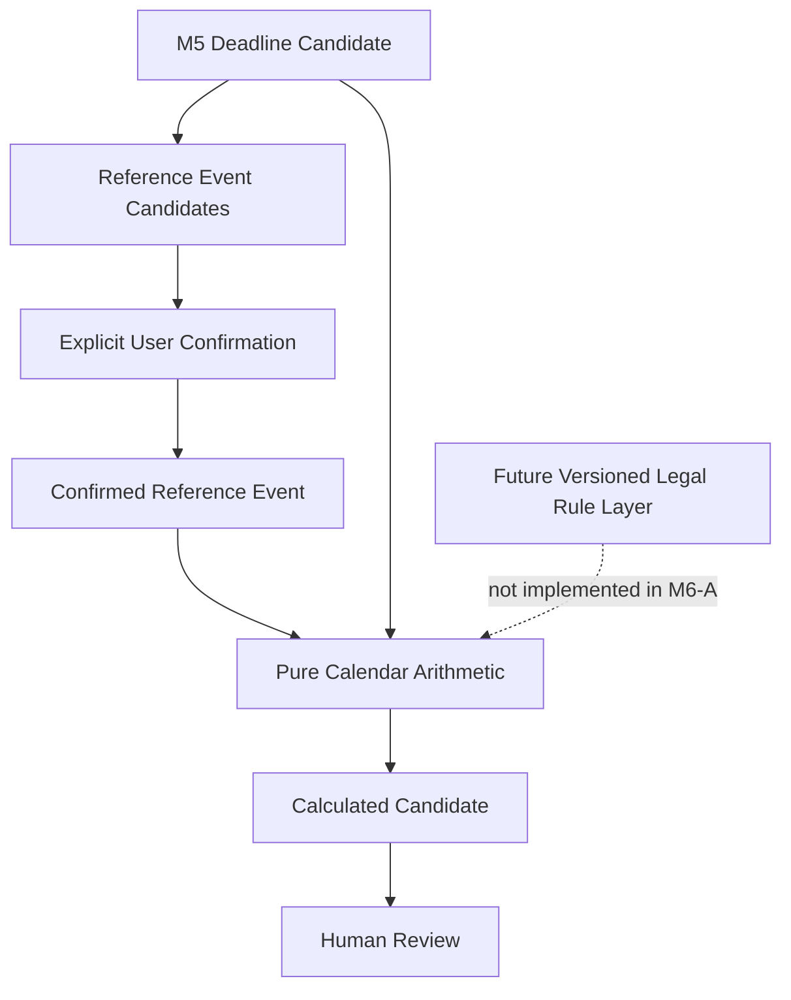

# ADR-002 — Confirmed Reference Events and Calendar Arithmetic (M6-A)

## Status
Proposed

## Context

M5 (Deadline Candidate Extraction) detects potential deadline candidates from document text but performs no date calculations. It outputs candidates with types: `EXPLICIT_DATE`, `RELATIVE_PERIOD`, and `QUALITATIVE_REFERENCE`. For `RELATIVE_PERIOD` candidates (e.g., "2 weeks after delivery"), a reference point must be identified and confirmed before any date arithmetic is meaningful.

M6-A must bridge this gap with the smallest safe slice:
1. Display possible reference events from M5 candidates
2. Require explicit user confirmation of a reference date
3. Perform pure calendar arithmetic (days/weeks only)
4. Output a non-binding calculation preview with full traceability

**Critical constraints from the project constitution (`specify/memory/constitution.md`):**
- All processing is local-only (no cloud, no external requests)
- No automated legal decisions (DSGVO Art. 22)
- Human review is structurally enforced for all legally relevant output
- Every confirmation action must be auditable
- No "deadline" terminology in results — these are "calculation previews"

**Integration point with M5:**
- M5 persists nothing (analyse-on-demand); all candidates are computed from `Document.text_content`
- M5's `DeadlineCandidate` has `kind=RELATIVE_PERIOD`, `amount`, `unit`, `reference_required=true`
- M6-A consumes M5 candidates but does NOT modify the M5 domain model

## Decision

### Selected: Variant B — Confirmation Persistent, Calculation On-Demand

We will implement **Variant B**: store confirmed reference events in SQLite (`confirmed_reference_events` table), but compute `CalendarCalculationCandidate` results on demand as a pure function of `(confirmed_date, duration_amount, duration_unit)`.

### Confirmation Gate Design

The core architectural innovation is the **confirmation gate** — a state machine that ensures no arithmetic is ever performed without explicit, auditable human action:

```
UNCONFIRMED ──(user confirms)──► CONFIRMED ──(user changes)──► CONFIRMED (previous → SUPERSEDED)
                                   │
                                   └──(user revokes)──► REVOKED
```

Every state transition creates a new row in `confirmed_reference_events` (append-only). The previous record is preserved with `SUPERSEDED` status. This implements a full audit trail in compliance with DSGVO Art. 30 (records of processing).

### Mathematical Calculation Layer

The calendar arithmetic is a **pure function** — no side effects, no external dependencies:

```
calculate(date, duration) → CalendarCalculationCandidate
```

- Days: `date + timedelta(days=N)`
- Weeks: `date + timedelta(weeks=N)` (equivalent to `date + timedelta(days=7*N)`)
- Python's `datetime.timedelta` handles leap years, month boundaries, and year boundaries correctly
- Only `DAY` and `WEEK` units supported
- `MONTH`, `YEAR`, `BUSINESS_DAY`, `WORKING_DAY`, `HOUR`, and `QUALITATIVE` are rejected with `UNSUPPORTED_DURATION_UNIT`

### Legal Rule Layer (Future — NOT in M6-A)

The following legal rule areas are explicitly deferred to future builds:
- **§ 187 BGB** (Fristbeginn — day exclusion/inclusion)
- **§ 188 BGB** (Fristende — month/year alignment, missing-day rule)
- **§ 193 BGB** / **§ 222(2) ZPO** (weekend/holiday → next Werktag)
- **§ 4 VwZG** (4-day delivery fiction)
- **§ 41 VwVfG** (4-day Bekanntgabefiktion)
- **§ 180 ZPO** (delivery fiction via mailbox)
- **Feiertagsgesetze** of the 16 Bundesländer

These will be implemented as **versioned rule profiles** with source metadata (`rule_id`, `norm_citation`, `version_tag`, `jurisdiction`), keeping the arithmetic layer pure and independent.

### Persistence Decision

| What is stored | What is computed |
|---------------|-----------------|
| Confirmed reference events (`confirmed_reference_events` table) | `CalendarCalculationCandidate` |
| Confirmation audit trail (timestamps, methods, supersession chain) | `CalculationStep` list |
| Provenance (document_id, offset, source_text) | Result warnings and adjustments |

**Schema (one new table):**
```sql
CREATE TABLE IF NOT EXISTS confirmed_reference_events (
    confirmation_id TEXT PRIMARY KEY,
    candidate_id TEXT,
    document_id TEXT NOT NULL REFERENCES documents(document_id) ON DELETE CASCADE,
    event_type TEXT NOT NULL,
    confirmed_date TEXT NOT NULL,
    source_type TEXT NOT NULL DEFAULT '',
    confirmation_method TEXT NOT NULL,
    confirmed_at TEXT NOT NULL,
    confirmed_by TEXT NOT NULL DEFAULT '',
    supersedes_confirmation_id TEXT
);
```

### API Impact

Four new REST endpoints under the existing M5 path hierarchy:

| Method | Path | Purpose |
|--------|------|---------|
| `GET` | `.../reference-events` | List reference event candidates (all UNCONFIRMED) |
| `POST` | `.../reference-events/confirm` | Confirm, reject, or revoke a reference event |
| `POST` | `.../calculation-preview` | Request arithmetic calculation preview |
| `GET` | `.../reference-events/history` | Full audit trail of all confirmations |

All endpoints follow existing conventions: versioned API (`/api/v1`), error envelope pattern, Pydantic schemas, and mandatory `human_review_required: true` in every response.

### Security Implications

- No external runtime requests — all arithmetic is local `datetime` math
- Confirmation timestamps are UTC, stored locally
- No reference dates or case data in logs (FR-M6A-030)
- `CASCADE DELETE` on document ensures DSGVO Art. 17 right to erasure applies automatically
- No authentication required (single local user per ADR-001)
- Binding remains on `127.0.0.1`

### Compliance Implications

| DSGVO Article | Implementation in M6-A |
|---------------|----------------------|
| Art. 5(1)(c) — Data Minimization | Only confirmed reference dates stored; no surrounding personal data |
| Art. 5(1)(e) — Storage Limitation | Confirmations bound to document lifecycle; CASCADE DELETE |
| Art. 15 — Right of Access | All confirmations retrievable per document (GET history endpoint) |
| Art. 17 — Right to Erasure | CASCADE DELETE on document → all confirmations deleted |
| Art. 22 — Automated Decisions | **Confirmation gate** — no calculation without explicit human action; `legal_validity_assessed=false` always |
| Art. 25 — Data Protection by Design | Local-only; no external requests; no reference dates in logs |
| Art. 30 — Records of Processing | Confirmation timestamp + method = full audit trail |

### Data Protection Implications

- Confirmed reference dates are personal data (linked to a specific case/document)
- Storage is minimized: only the date itself, not surrounding text or context
- All data stays on the local machine — no cloud, no telemetry
- CASCADE DELETE ensures cleanup when a document is deleted
- Warning codes cover safety gaps: `CALCULATION_PREVIEW_ONLY`, `NO_WEEKEND_OR_HOLIDAY_ADJUSTMENT`, `HUMAN_REVIEW_REQUIRED`

### Migration Path

**From M5 (current state):**
- No existing persistence to migrate (M5 is stateless analyse-on-demand)
- Add `confirmed_reference_events` table to schema initialization
- No data migration needed
- M5 API endpoints are unchanged — M6-A endpoints extend them

**To M6-B (future legal rule layer):**
- The `CalendarCalculationCandidate` and `CalculationStep` data structures are designed to accommodate additional rule-application steps
- `adjustments_applied` dict can be extended with new booleans for legal rules
- `CalculationOperation` enum can be extended with rule-application operations
- `VersionedRuleProfile` schema (sketched in research RQ-09) can be added orthogonally

### Rollback Strategy

If M6-A must be rolled back:
1. Drop the `confirmed_reference_events` table
2. Remove the four new API routes
3. No impact on M5 functionality (M5 is stateless)
4. No impact on M1-M4 (cases, documents — foreign key is CASCADE)
5. Frontend that depends on M6-A endpoints receives 404s (graceful degradation)

If Variant B proves insufficient for future needs (e.g., need for historical calculation reproducibility with changing rule profiles):
- Can add a `calculated_results` table later (migrate to Variant C) since the pure-function approach means all results are recomputable
- This is not expected to be necessary before M6-B

## Alternatives Considered

### Variant A — Fully Stateless On-Demand

**Description:** No confirmation stored. User provides reference date + M5 duration for every calculation. Nothing persisted.

| Pro | Contra |
|-----|--------|
| No schema changes, no migration | No audit trail — confirmation cannot be proven |
| Simplest implementation | DSGVO Art. 30 violation — no record of processing |
| No stale results possible | Confirmation not reproducible — user must re-enter every time |
| | Cannot display confirmation history |
| | Each calculation request requires ALL inputs repeated |

**Verdict: REJECTED.** Audit trail is non-negotiable for a legal support tool. DSGVO Art. 30 requires records of processing activities. Without persistent confirmations, there is no way to demonstrate what a user confirmed or when.

### Variant B — Confirmation Persistent, Calculation On-Demand (SELECTED)

**Description:** Confirmed reference events stored in SQLite. Calendar calculation candidates computed on demand from stored confirmation + M5-detectable duration.

| Pro | Contra |
|-----|--------|
| Full audit trail (append-only) | Slightly more complex than Variant A |
| DSGVO Art. 30 compliant | Requires one new database table |
| Confirmation history viewable | |
| Calculations always fresh (no stale results) | |
| Minimal schema change (one table) | |
| CASCADE DELETE ensures data lifecycle | |
| Deterministic pure function → reproducible | |

**Verdict: SELECTED.** Balances auditability, simplicity, and correctness. The confirmation is the only thing that must be persisted because it represents an irreversible human action. The arithmetic is deterministic and recomputable — no value in caching results that can become stale.

### Variant C — Both Persistent

**Description:** Both `ConfirmedReferenceEvent` AND `CalendarCalculationCandidate` stored in SQLite. Historical results preserved exactly.

| Pro | Contra |
|-----|--------|
| Historical exact reproducibility | Stale results when reference date changes — needs invalidation logic |
| Can compare historical results | Two new tables, more complex schema |
| | Cache invalidation is a hard problem |
| | Overengineered for M6-A's current scope |
| | More migration complexity |
| | More storage with no benefit while rules are simple |

**Verdict: REJECTED for M6-A.** The added complexity of cache invalidation and dual persistence provides no benefit when arithmetic is a deterministic pure function. If future builds introduce non-deterministic rules (e.g., holiday databases that change year to year), Variant C can be adopted incrementally by adding a `calculated_results` journal table.

## Architecture Validation Results

All 18 checklist items verified against spec, data-model, contracts, and research:

| # | Criterion | Status | Evidence |
|---|-----------|--------|----------|
| 1 | M5 DeadlineCandidate ↔ ReferenceEvent separation | ✅ PASS | Distinct domain types; M5 unchanged; M6-A extends M5 |
| 2 | Unconfirmed candidate ↔ confirmed date separation | ✅ PASS | `ReferenceEventCandidate.UNCONFIRMED` vs `ConfirmedReferenceEvent.CONFIRMED` |
| 3 | Explicit User-Confirmation-Gate | ✅ PASS | INV-M6A-01/03, FR-M6A-003/011; POST confirm endpoint as mandatory gate |
| 4 | Pure CalendarArithmetic component | ✅ PASS | `date + timedelta(days/weeks)` only; no legal rules |
| 5 | Days and weeks only | ✅ PASS | INV-M6A-05/06/07; `UNSUPPORTED_DURATION_UNIT` for month/year |
| 6 | No month/year arithmetic | ✅ PASS | FR-M6A-014; SC-M6A-004 |
| 7 | No weekend/holiday adjustment | ✅ PASS | INV-M6A-08; adjustments flags permanently `false` |
| 8 | No delivery fiction | ✅ PASS | INV-M6A-09; explicit `NO_DELIVERY_OR_ANNOUNCEMENT_RULE_APPLIED` warning |
| 9 | No legal rule auto-selection | ✅ PASS | INV-M6A-10; `legal_rule_applied: false` always |
| 10 | No framework dependency in domain | ✅ PASS | All domain types are pure dataclasses + enums; no FastAPI/SQLite imports |
| 11 | Traceable calculation path | ✅ PASS | `calculation_steps` list with step, operation, input, amount, output |
| 12 | Stable result and warning codes | ✅ PASS | `CalculationWarningCode` enum; 15 stable warning codes in spec |
| 13 | Future versioned Rule Profiles | ✅ PASS | Research RQ-09 sketches schema; SC-M6A-013 ensures future compatibility |
| 14 | Persistence vs on-demand | ✅ PASS | Variant B: confirmation persistent, calculation on-demand |
| 15 | API contract consistency | ✅ PASS | REST hierarchy, error envelope pattern, warning vs error distinction |
| 16 | Revocation/change of confirmation | ✅ PASS | US6; SUPERSEDED/REVOKED state machine; append-only audit trail |
| 17 | Idempotency | ✅ PASS | Confirmation: new record per action; Calculation: deterministic pure function |
| 18 | Testability | ✅ PASS | Domain: pure dataclasses; Arithmetic: pure function; Gate: mockable repository |

## Architecture Diagram



**Data flow:**

1. **M5 → Reference Event Candidates:** `DeadlineCandidate(kind=RELATIVE_PERIOD)` with `amount`, `unit`, and `reference_required=true` triggers candidate generation. M5 `EXPLICIT_DATE` candidates in the same document provide suggested dates. All candidates start as `UNCONFIRMED`.

2. **Candidates → User Confirmation:** User reviews candidates, confirms a reference date (or manually enters one, or rejects). This is the mandatory gate — no bypass possible.

3. **Confirmation → Arithmetic:** Confirmed reference date + M5 duration → pure `datetime` addition. Only `DAY` and `WEEK` units passed through.

4. **Arithmetic → Preview → Review:** Result is always `human_review_required=true`, `legal_validity_assessed=false`, and carries mandatory warning codes.

5. **Future Legal Layer (dashed):** Versioned rule profiles will plug into the calculation pipeline without altering the confirmation gate or arithmetic foundation.

## Database Schema Impact

Only one new table added to the existing SQLite schema:

```sql
-- Confirmed reference events (persistent per Variant B)
CREATE TABLE IF NOT EXISTS confirmed_reference_events (
    confirmation_id TEXT PRIMARY KEY,
    candidate_id TEXT,
    document_id TEXT NOT NULL REFERENCES documents(document_id) ON DELETE CASCADE,
    event_type TEXT NOT NULL,
    confirmed_date TEXT NOT NULL,       -- ISO date: YYYY-MM-DD
    source_type TEXT NOT NULL DEFAULT '',
    confirmation_method TEXT NOT NULL,
    confirmed_at TEXT NOT NULL,         -- ISO datetime UTC
    confirmed_by TEXT NOT NULL DEFAULT '',
    supersedes_confirmation_id TEXT
);

CREATE INDEX IF NOT EXISTS idx_confirmed_reference_events_document
    ON confirmed_reference_events(document_id);
```

**Key design decisions:**
- `confirmation_id` as TEXT (UUID) — consistent with existing `documents(document_id)` pattern
- `document_id` as foreign key with `ON DELETE CASCADE` — ensures DSGVO right to erasure
- `confirmed_date` as ISO text — SQLite has no native date type; ISO-8601 strings are sortable and portable
- `supersedes_confirmation_id` — self-referencing for audit chain (null for first confirmation)
- No foreign key to `deadline_candidates` — M5 has no persistence table
- No `CalendarCalculationCandidate` table — computed on demand

## Open Follow-Up Decisions

| ID | Topic | When | Depends on |
|----|-------|------|------------|
| FUP-001 | Frontend: How to render the confirmation gate in the UI (confirmation dialog design, warning badges) | Before M6-A release | ADR-002 |
| FUP-002 | Versioned Rule Profiles: Schema for `LegalRuleSource` with `rule_id`, `norm_citation`, `version_tag` | M6-B (legal rule layer) | ADR-002 |
| FUP-003 | If performance demands (unlikely for single-user): Add calculation result caching or a `calculated_results` journal table | TBD — not expected before M6-B | ADR-002 |
| FUP-004 | Multi-user support: `confirmed_by` field currently `str`; needs user identity concept when multiple users exist | When multi-user becomes a requirement | ADR-001 |
| FUP-005 | Holiday database: Which format/source for 16 Bundesländer Feiertagsgesetze data | M6-B (holiday adjustment) | ADR-002 |
| FUP-006 | PDF page mapping for offsets: M5 offsets refer to concatenated text; mapping to PDF pages is lost | Future UX improvement | M5 data-model |

## Final Verdict

### **ARCH_GREEN**

**Rationale:**

The M6-A architecture achieves clean separation across all critical boundaries:

1. **Domain Integrity:** M5 (detection) and M6-A (confirmation + arithmetic) are cleanly separated. M5 is unchanged. M6-A extends M5 without modifying it. The domain layer contains no framework dependencies — pure dataclasses and enums throughout.

2. **Safety by Design:** The confirmation gate is not a recommendation — it is a structural barrier. No code path exists from M5 detection to M6-A arithmetic that bypasses user confirmation. This satisfies DSGVO Art. 22 and the project constitution's prohibition on automated legal decisions.

3. **Appropriate Scope:** Only days and weeks are supported. All legal rule application (BGB, ZPO, VwZG, VwVfG, Feiertagsgesetze) is explicitly deferred with clear boundaries. The spec says what it does NOT do as clearly as what it does.

4. **Auditability:** Every confirmation action is recorded with timestamp, method, and provenance. The append-only model means no confirmation is ever lost or silently modified. This is a legal support tool — the audit trail is not optional.

5. **Simplicity:** One new table. No cache invalidation. No stale data. Pure functions for calculation. The architecture does exactly what is needed and nothing more.

6. **Extensibility:** The future legal rule layer has a clear integration point (the `adjustments_applied` dict, the `CalculationStep` list, the `CalculationOperation` enum). The arithmetic component can remain pure while legal rules are applied as post-processing steps.

No architectural concerns remain open. All 18 validation criteria pass. The three variants have been thoroughly evaluated and Variant B is unambiguously the correct choice for M6-A.

---
*ADR-002 authored: 2026-07-14. Next review: before M6-B (legal rule layer) implementation.*
